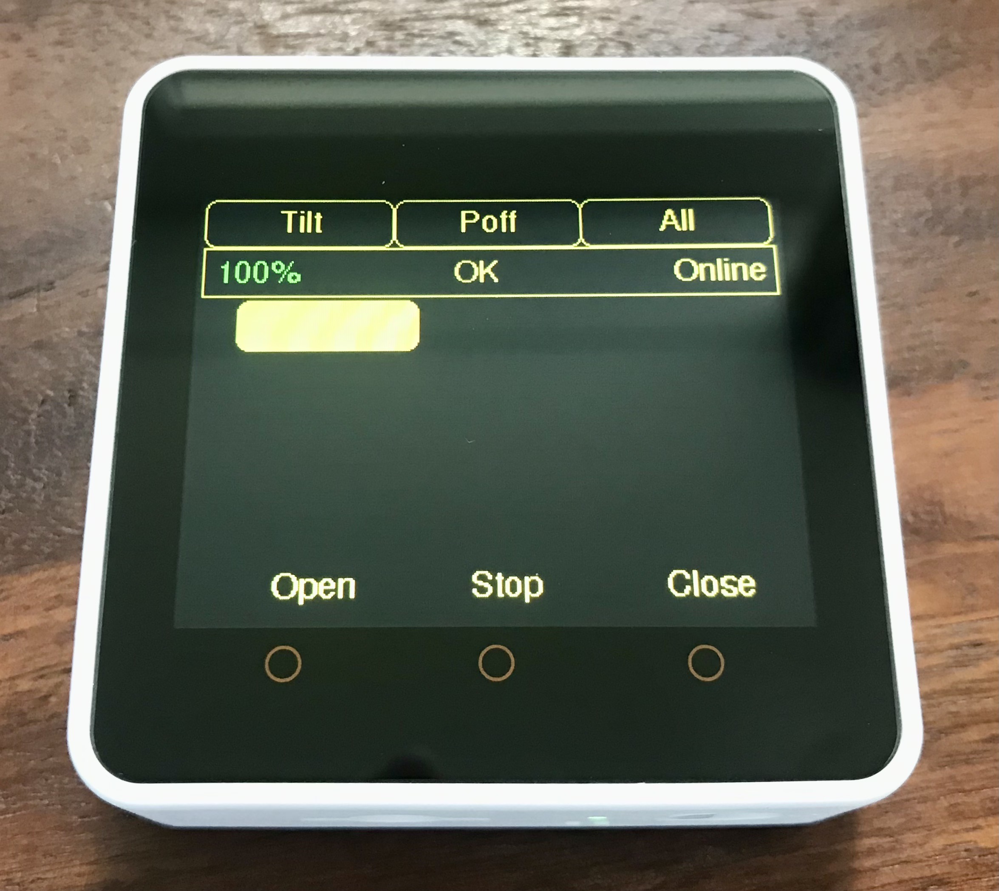

# M5Core2BlindsController

An program to control remotely blinds via [Shelly 2.5 relays](https://shelly.cloud/products/shelly-25-smart-home-automation-relay/) with a [M5Stack Core2 ESP32](https://shop.m5stack.com/collections/m5-controllers/products/m5stack-core2-esp32-iot-development-kit) device.

## User instructions



- **Power button** (on the left of the M5Stacke Core 2): Pressing the power button starts the device. It takes a few seconds until it is ready. Pressing the power button for a few seconds shuts down the device when it is running.
- **Tilt** button: Moves all selected blinds to the tilt position if they are configured to be tiltable. Note that for this to work the Shelly 2.5 needs to be calibrated first. The calibration can be done e.g. from the Shelly Cloud App available from Google Play or the Apples App Store.
- **Poff** button: Shuts down the device. Note that the device will automatically shut down after the configured idle timout is exceeded.
- **All** or **None** button: When pressed the label changes from **All** to **None** and vice versa.
  - **All** enables all blinds.
  - **None** disables all blinds.
- Status bar:
  - **Percentage** indicator: Shows the battery level.
  - **Status Message**: Information about the status of the device.
  - **Online** or **Offline** indicator: Shows whether the device is connected to WiFi or not.
- **Blind selection** buttons: There is a button for each configured blind. Depending on its configuration the position of the button indicates the physical position of the blind. Pressing the button enables or disables the blind. If the buttons fill color is yellow the blind is enabled. If the buttons fill color is black the blind is disabled.
- Hardware buttons (orange circles below the display):
  - **Open** button: Opens the selected blinds.
  - **Stop** button: Stops the current motion of the selected blinds.
  - **Close** button: Closes the selected blinds.

## Configuration an deployment

### Example sketch

1. Put the M5Core2BlindsController folder with its contents into your libraries folder of your Arduino environment.
2. Open the example sketch `m5_blinds_controller_with_one_blind` in the Arduino IDE from the File &rarr; Examples &rarr; M5Core2BlindsController menu.
3. Adjust the configuration in the sketch according to the instructions below.
4. Connect your M5Stack Core 2 device and upload the program.

### Configuration

```C++
  struct BlindConfiguration {
    unsigned int id;
    unsigned int buttonPositionX;
    unsigned int buttonPositionY;
    unsigned int buttonWidth;
    unsigned int buttonHeight;
    const char* iP;
    bool canTilt;
    float tiltPositionInPercent;
  };
```

1. In the `appConfig` struct replace the placeholders `"your_ssid"` with the SSID of your WiFi and `"your_passphrase"` with the passphrase for your WiFi.
2. In the array of the `blindConfigs[1]` struct replace the `1` with the number of blinds you want to control.
3. Add for each blind a `BlindConfiguration` struct with the parameters according to the definition of the struct (above). Note that
   - the `id` must be unique,
   - the parameters for the button position must be chosen such that the button is inside the rectangle 0 &le; x &le; 319 and 60 &lt; y &lt; 209. Furthermore, the buttons should not overlap with each other and they should be large enough that they can easily be pressed.
   - the `ip` is of the format `"xxx.xxx.xxx.xxx"`.
   - the flag `canTilt` shall be set to false if it is not a venetian blind or some sort of blind without lamellae. In order to use the tilt feature each blind needs to be calibrated. The calibration can be done e.g. from the Shelly Cloud App available from Google Play or the Apples App Store.
   - the `tiltPositionInPercent` shall be set such that the lamellae are in the correct tilted position when the blind is opened from its closed position. You can find the ideal position by playing around with "saved position" featur in the Shelly Cloud App after the calibration.

### Trouble shooting

- Make sure the required dependencies are available.
- Make sure the correct board is configured.
- Open the serial monitor with 115200 baud to get some output in case of problems.

## Development Documentation

### Requirements

- [Use cases](documentation/use-cases.md)

### Design

You could argue that the chosen architecture and design are an overkill for this project. But I used this project not only to realize the remote control. I wanted to gain hands-on experience with Arduino and use it as an excercise for my learnings from [Righting software](https://g.co/kgs/HB29Pg) and [Clean architecture](https://g.co/kgs/wm3xkQ). Having read these books will certainly help you understand some of my architecture and design decisions.

- [Architecture](documentation/architecture.md)
- [UI design](documentation/ui-design.md)

### Testing

The code in the folders `backend` and `hmi` is agnostic of the Arduino specifics. It is, therefore, testable without the hardware. I use googletest and googlemock to test these classes. Running the tests requires [Bazelisk](https://github.com/bazelbuild/bazelisk). You can run the tests by opening a shell in the base directory and by executing

```Shell
bazelisk.cmd test --test_output=all //:tests
```

The classes in the folder `firmwareAbstraction` are shallow wrappers for Arduino and board specific functionality. Due to their simplicity I did not take the pain to setup automatic testing for them on the target device.
